# AndroidStudioのインストール

[AndroidStudioのサイト](https://developer.android.com/studio?hl=ja)へ飛ぶ。

「Download Android Studio」をクリック
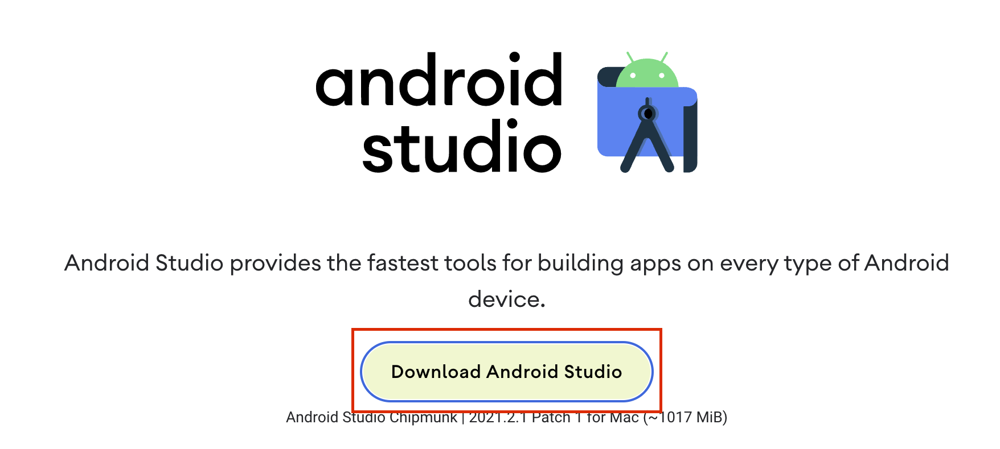

ダウンロード出来たら解凍し、
「Android Studio」のアイコンを「Applications」にドラッグ＆ドロップで入れる
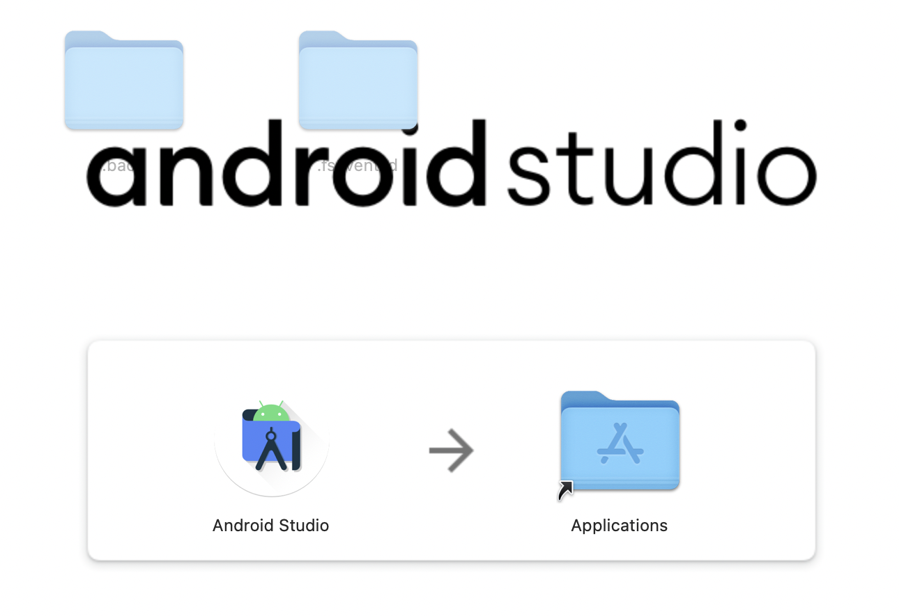

Applicationsを開き、AndroidStduioを起動
「Next」で進む
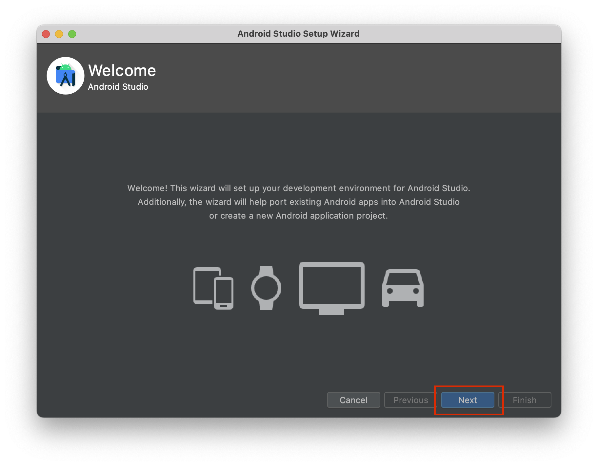

「Standard」を選択
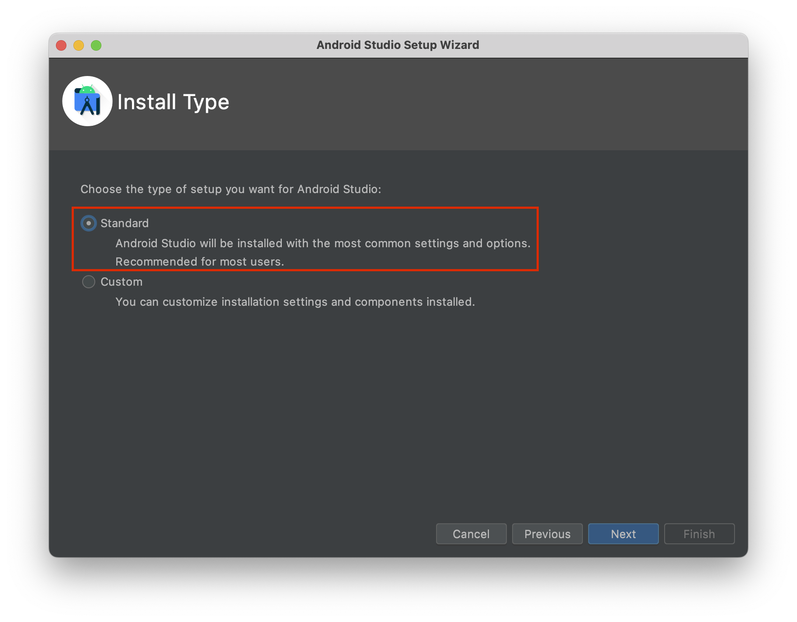

好きなテーマを選択
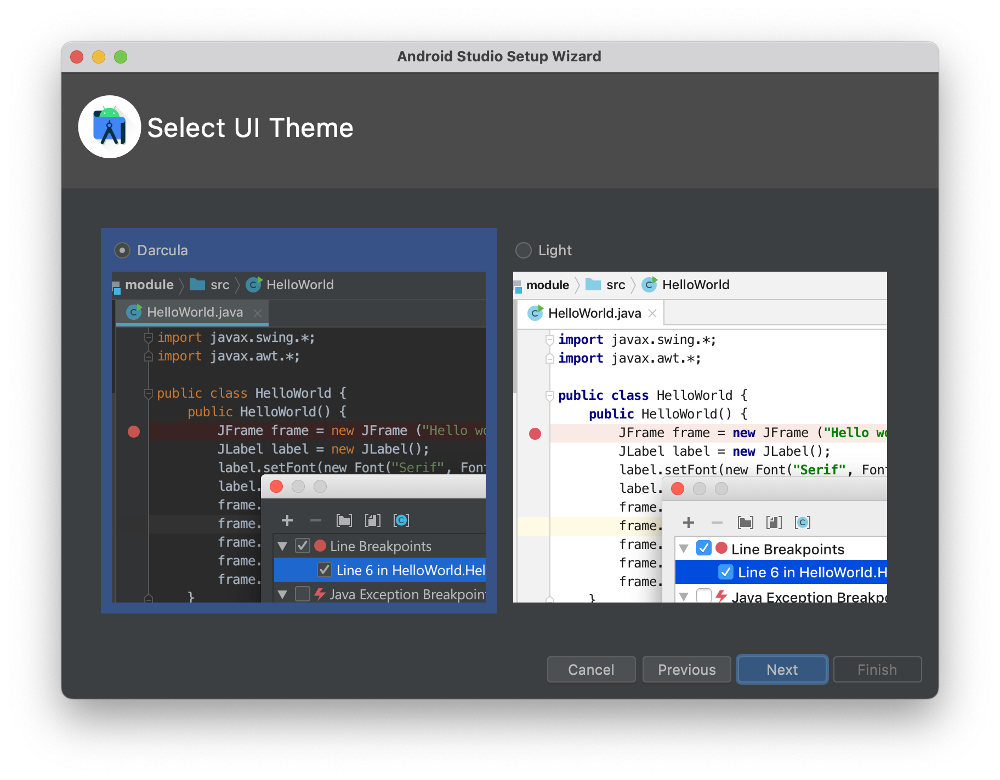

インストールするものを確認
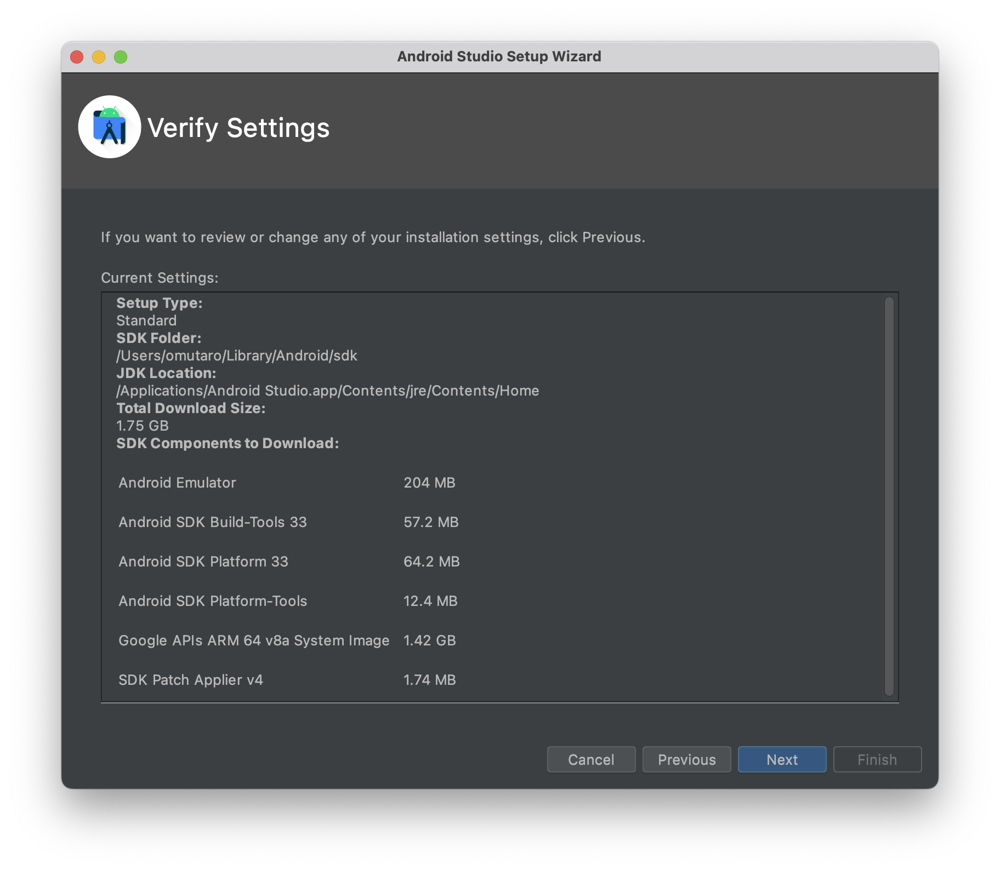

ライセンスを読み、「同意」を選択
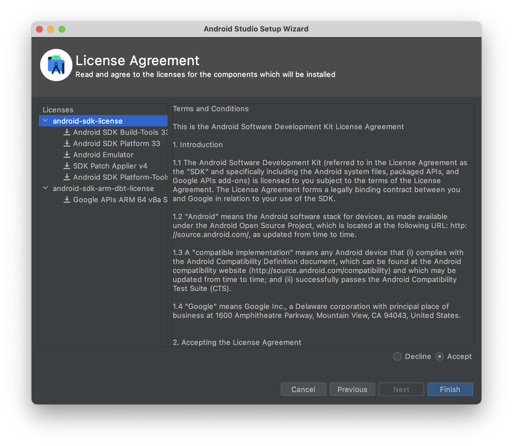

インストールが始まる
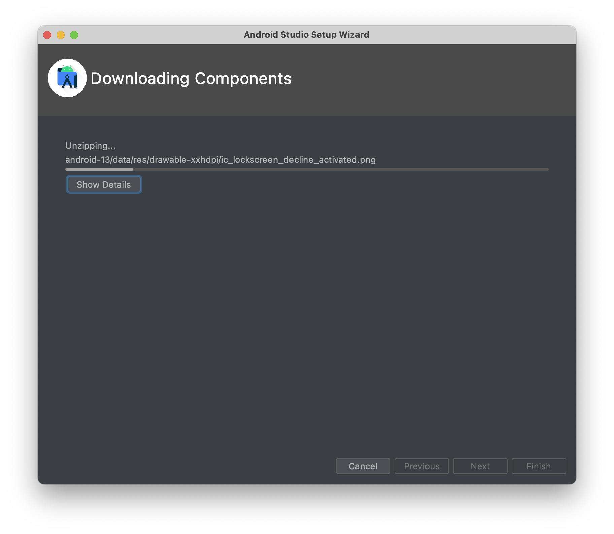

インストールが終わると「Finish」を選択して終了

# Hello Worldを表示させる

自動的にAndroid Studioが立ち上がる。
New Projectを選択
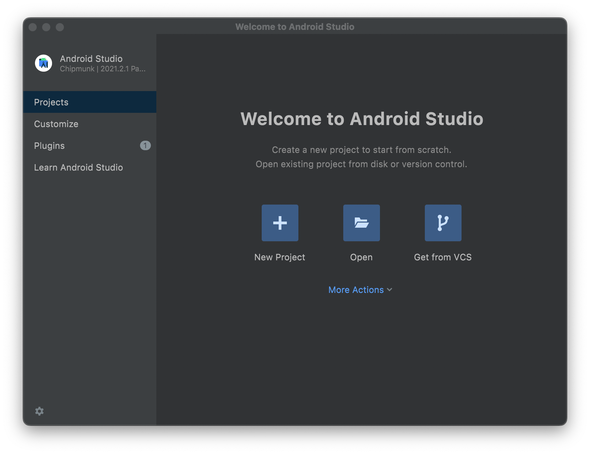

「Empty Activity」を選択
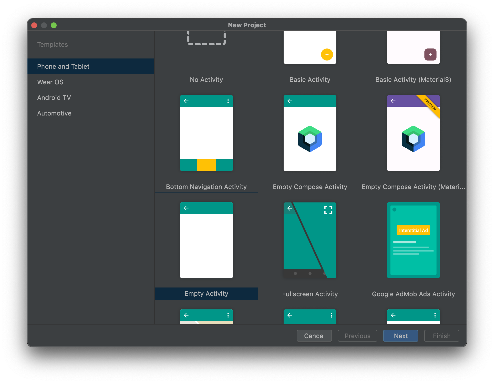

Nameに適切な名前を入力
LanguageはJavaかKotlinは好きな方を選択
Finishを押すとプロジェクトが生成される
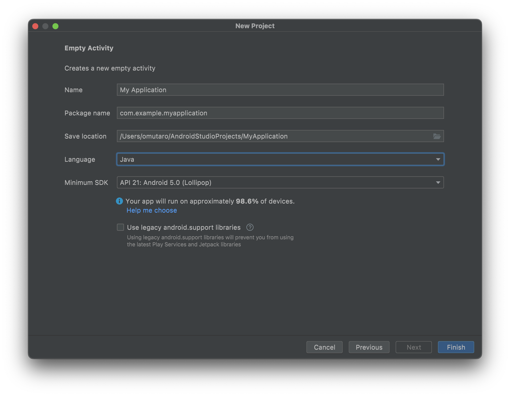

プロジェクト画面
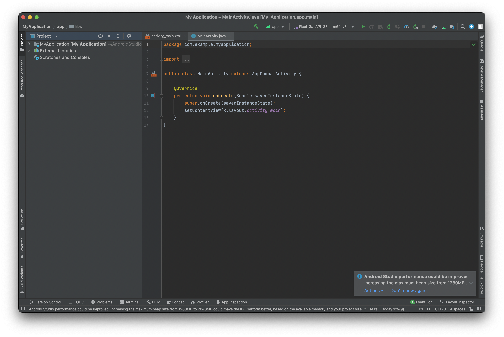
